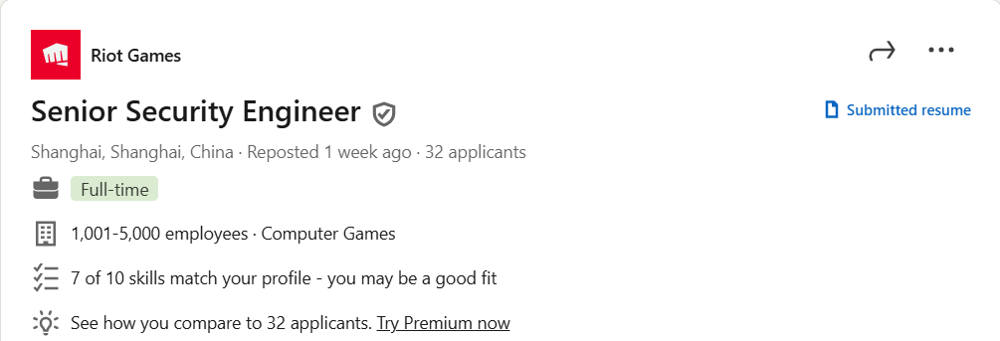
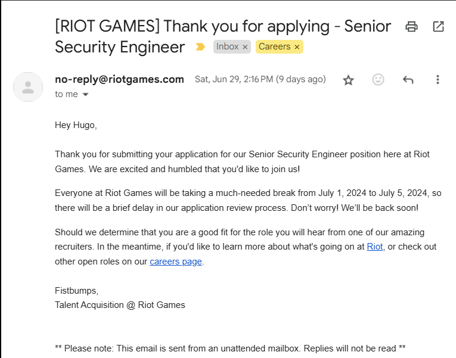
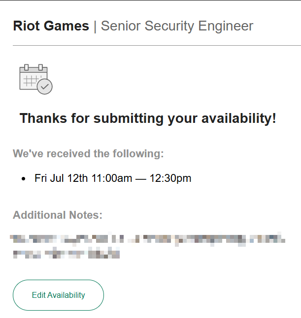

# Riot Games | Senior Security Engineer

在2024年6月末，闲逛 LinkedIn 中发现以下岗位

随即就去 Riot Games 官网查看具体岗位详情，为了防止岗位下架无法查看，我把 jd 复制过来了。

> Riot Games. (2024, June). Senior Security Engineer. Retrieved from https://www.riotgames.com/en/work-with-us/job/6012459/senior-security-engineer-shanghai-china

Information Security Group

Riot Operations & Support

Shanghai, China

JOB ID: REQ-0008126

Riot engineers bring deep knowledge of specific technical areas but also value the opportunity to work in a variety of broader domains. As Security Engineers, we work with and assess both new and current technology, creating practical solutions to improve our security maturity level and protect Riot and our players.

As a **Senior Security Engineer of InfoSec**, you will work on a diverse team across the world to support information security protection and defense. You will act as a subject matter expert in certain infosec domains and be accountable for setting up the China security governance, providing security risk analysis and improving the security awareness. You will report to the China Head of Infosec.

## Responsibilities:

- Manage and maintain the measurement to monitor and report on the control effectiveness in all information security area in China
- Ensure the local security governance fulfillment, e.g. MLPS
- Conduct security risk management tasks and collaborate with teams of different functions to encourage the security concept across the business process
- Localize the security policies, standards and guidelines, and ensure the implementation to the business operation
- Support the regional office network/endpoint security setup and review
- Be on rotational on-call for global infosec support and operational assessment
- Provide and support in meaningful security reviews on suppliers, platforms, and applications
- Liaise with business security champions for infosec practice implementation and security awareness promotion

## Required Qualifications

- 6+ years of hands-on experience in security governance and risk management
- Bachelor’s degree or above
- Knowledge and understanding of information security frameworks and governance, e.g. MLPS, NIST, ISO 27001
- Experience in local security standards and regulations including filing, registration and assessment (CSL, DSL, PIPL)
- Demonstrate a high degree of operational knowledge in the risk management and vendor security management lifecycle
- Strong project management skills and multi-tasking management abilities across multiple teams with complex products and services in a diverse and dynamic environment
- Understanding of Network protocol (TCP/IP) and security practices (Segmentation, Firewalls, Etc.)
- Basic knowledge in scripting language, e.g. Perl, Python
- Good communication and interpersonal skills with an ability to proactively influence and collaborate with stakeholders, and translate technical concepts to non-technical audiences
- Must embrace Riot’s culture, values and missions

## Desired Qualifications

- Knowledge of development, DevSecOps and SDLC methodologies
- Experience in application security including penetration test and code review
Don’t forget to include a resume and cover letter. We receive a lot of applications, but we’ll notice a fun, well-written intro that shows us you take play seriously.

For this role, you'll find success through craft expertise, a collaborative spirit, and decision-making that prioritizes the delight of players. We will be looking at your past studies, experience, and your personal relationship with games. If you embody player empathy and care about the experiences of players, this could be the role for you!

## Our Perks:

Riot Games fosters a player and workplace experience that values teamwork embodied by the Summoner's Code and Community Code. Our culture embraces differences as a strength, and our values are the guiding principles for how we approach work. We are committed to putting diversity and inclusion (D&I) at the center of everything we do, and promoting a fair and collaborative culture where Rioters treat one another with dignity and respect. We encourage you to read more about our value of thriving together and our ongoing work to build the most inclusive company in gaming.

# Application

把握机会，当场就是一个投递申请

约好面试时间

# Conclusion